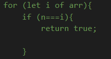

## JS
### Loops
####  for loop
---
 for loopi iteratsiya qilish uchun ishlatiladi va uni ikki xil usulda ishlatish mumkin
 
 1. Sonlar iteratsiyasi:
 

      
 2. array yoki object elementlari iteratsiyasi yani

      

---
#### while loop
---
while loopi berilgan condition false ga teng bulguniga qadar looping qiladi

example:

---
### Functions
Function js da ma'lum bir vazifani bajarish uchun yozilgan procedure hisoblanadi va uni biz bir xil procedure larni takror ishlatishni oldini olgani ishlatamiz

#### Function 3 xil xolatda define qilish mumkin:
* function expression

    Bu turdagi function lar define qilinishi bilanoq run qilishni boshlaydi, va function               declaration  dan farqi function name tashlab ketib anonymous function yaratish mumkin
    

* function declaration
    
    Malum bir nom uchun biriktirilgan function hisoblanadi
     

* arrow function

     Bu turdagi function lar function ichidagi procedure lar kam bulgan vaqtda va return value function call bulgandayoq qaytarilganda ishlatiladi

      

### Arrays

#### About Array
---
Primitive data type bulib birdan ortiq data ni saqlash uchun ishlatiladi

`const cars = ["Saab", "Volvo", "BMW"];`

va ular bunday define qilinadi:

`const array_name = [item1, item2, ...];`

Ularning type i object hisoblanadi

---
#### Array Methods
---
`arr.length` bu method orqali array length i aniqlanadi

`arr.push(a)` bu method orqali array ning oxiriga yangi element qushiladi

`arr.pop` bu method orqali array oxiridagi element uchiriladi

`arr.shift()` bu method orqali array boshidagi element uchiriladi

`arr.unshift(a)` bu method orqali array boshiga yangi elemet qushiladi

---
### Objects

object uzidagi malumotlarga ularga berilgan nom bilan access qilish imkoniyatini beradi

`const person = {firstName:"John", lastName:"Doe", age:46};`

ular function, object va array type larini ham uzida saqlashlari mumkin.

`person.firstname;`
orqali object elementi chaqiriladi.